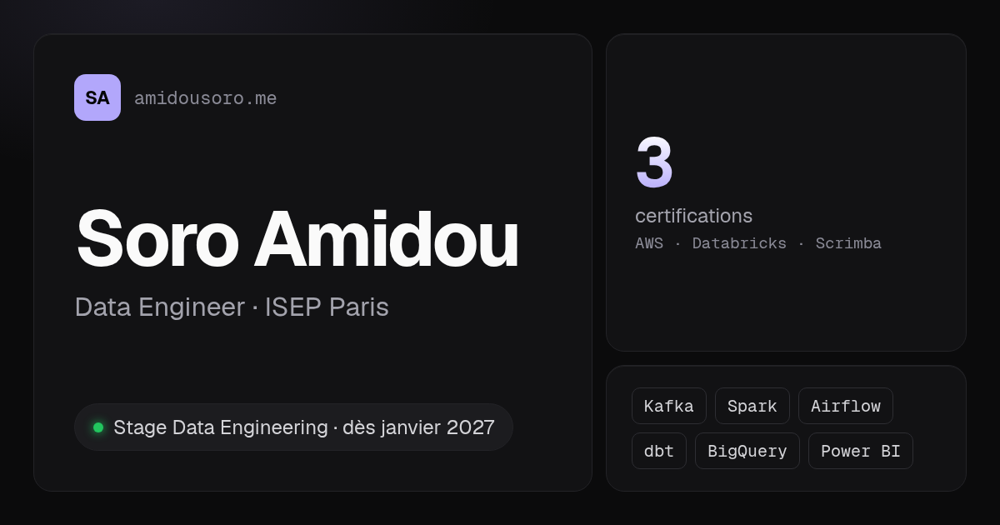
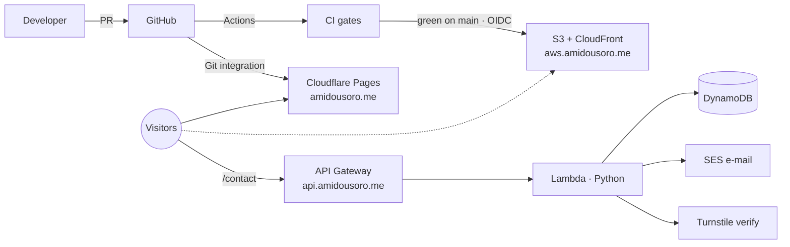

<div align="center">

<a href="https://amidousoro.me">
  
</a>

# Soro Amidou — Portfolio

**Data Engineering student · ISEP Paris · AWS & Databricks certified**
<br>
Looking for a Data Engineering internship from **January 2027**.

[](https://github.com/AmidNova/portfolio/actions/workflows/ci.yml)
[](https://github.com/AmidNova/portfolio/actions/workflows/deploy-aws.yml)
[](https://github.com/AmidNova/portfolio/actions/workflows/terraform.yml)
[](LICENSE)


[**amidousoro.me**](https://amidousoro.me) · [AWS mirror](https://aws.amidousoro.me) · [DevOps write-up](docs/devops.md)

</div>

---

## Overview

A dark, bento-style personal site in French and English — and a small production system around it. The front end is a static React app; everything else is treated like real infrastructure: two hosting platforms declared in Terraform, a gated CI pipeline, a strict security policy, measured performance, and a serverless contact backend on AWS.

| | |
| --- | --- |
| 🧩 **Bento home** | Summary first, detail on click: projects, certifications, toolbox, journey, stats. |
| 🗂️ **Projects** | `/projects` page with filters and case studies (architecture diagrams, media, metrics). |
| 🌍 **Bilingual** | FR / EN, every visible string in `src/locales/`, choice remembered per visitor. |
| ✉️ **Contact** | `/contact` form → API Gateway → Lambda (Python) → DynamoDB + SES, protected by Cloudflare Turnstile. |
| ☁️ **Multi-cloud** | Same build served by Cloudflare Pages and AWS S3 + CloudFront, [compared on latency and cost](docs/devops.md#5b-cloudflare-vs-aws-measured). |
| 🔒 **Hardened** | Strict CSP (one hashed inline script, third parties allowed by exact origin), HSTS, COOP, Permissions-Policy. |

## Architecture



No server to patch, no long-lived cloud keys in CI: GitHub Actions reaches AWS through **OIDC**, Terraform state lives remotely, and both hosts read their security headers from a single file, `public/_headers`.

## Engineering highlights

<table>
<tr>
<td width="50%" valign="top">

**Quality gates on every PR**

- ESLint + pre-commit hook (Husky, lint-staged)
- 100+ tests — Vitest + Testing Library (front), pytest with ≥ 80 % coverage (backend)
- Type-checked production build
- CSP hash guard: the build fails if an inline script isn't covered by the policy
- Lighthouse CI budgets on `/`, `/projects`, `/about`
- File-size guard (Cloudflare's 25 MiB limit)
- Live preview URL for every branch

</td>
<td width="50%" valign="top">

**Lighthouse budgets (mobile, throttled)**

| Metric | Gate |
| --- | --- |
| Performance | ≥ 90 |
| Accessibility | **100** |
| Best practices | **100** |
| SEO | **100** |
| CLS | ≤ 0.1 |
| LCP | ≤ 2.5 s (warn) |

**Infrastructure as code**

- `infra/cloudflare` — DNS, Pages, zone TLS
- `infra/aws` — S3, CloudFront, OIDC roles, budget, contact API
- `terraform plan` posted as a PR comment

</td>
</tr>
</table>

> The full story — architecture, pipeline, security headers, performance work, Cloudflare vs AWS measurements, runbooks and decision log — is in **[docs/devops.md](docs/devops.md)**.

## Tech stack

| Layer | Tools |
| --- | --- |
| **Front end** | React 19 · TypeScript · Vite · Tailwind CSS v4 · Framer Motion · React Router v7 |
| **Testing** | Vitest · Testing Library · jsdom · pytest |
| **Backend** | AWS Lambda (Python) · API Gateway HTTP API · DynamoDB · SES · Cloudflare Turnstile |
| **Hosting** | Cloudflare Pages · AWS S3 + CloudFront |
| **Infra & CI/CD** | Terraform · GitHub Actions · OIDC · Dependabot · Lighthouse CI |
| **Analytics** | Umami (privacy-friendly, allowed by exact origin in the CSP) |

## Project structure

```
src/
  components/   bento cards, pages and shared UI
  data/         profile.ts — projects, certifications, toolbox, experience
  locales/      fr.ts / en.ts — every visible string
  context/      LangProvider (FR/EN)
  lib/          pure helpers (project filter, contact API, Turnstile, …)
  __tests__/    component and behaviour tests
backend/
  contact/      Lambda handler + pytest suite
infra/
  cloudflare/   Terraform — DNS, Pages, zone settings
  aws/          Terraform — S3, CloudFront, OIDC, contact API, budget
scripts/        CSP hash guard
public/         _headers, og.png, CV, robots.txt, sitemap.xml
docs/           devops.md
```

Content lives in `src/data/profile.ts` and the two locale files: adding a project there adds it to the home marquee and to `/projects`.

## Getting started

Requires Node 22 (pinned in `.nvmrc`).

```bash
git clone https://github.com/AmidNova/portfolio.git
cd portfolio
nvm use
npm ci
npm run dev        # http://localhost:5173
```

| Command | What it does |
| --- | --- |
| `npm run dev` | Dev server with HMR |
| `npm run build` | Type-check (`tsc -b`) and production build to `dist/` |
| `npm run preview` | Serve the built `dist/` |
| `npm run lint` | ESLint |
| `npm run test:run` | Run the test suite once |
| `npm run coverage` | Tests with coverage |

Backend tests:

```bash
cd backend
pip install -r requirements-dev.txt
pytest --cov=contact
```

## Deployment

1. Work on a branch, open a pull request.
2. CI runs every gate; Cloudflare publishes a preview.
3. Merge to `main` → Cloudflare Pages deploys production, then the AWS mirror deploys once CI is green.
4. Rollback = revert PR (or redeploy a previous build from Cloudflare).

## License

The **source code** is released under the [MIT License](LICENSE).

**Personal content** — photos, CVs, project media, logos, certification badges and the profile text — is **not** covered by it and remains all rights reserved. Forking to build your own portfolio is welcome; please replace that content with your own.

<div align="center">
<br>
<sub>Built and operated by <a href="https://amidousoro.me">Soro Amidou</a> · Paris</sub>
</div>
