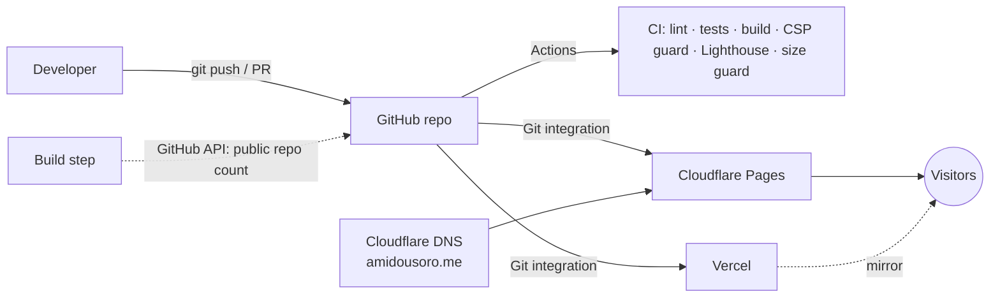
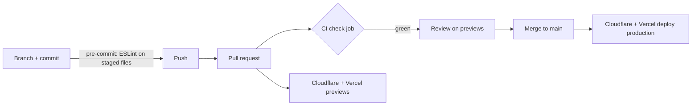

# DevOps — how this site is built, checked and shipped

This document covers everything around the code: hosting, the delivery pipeline, the quality and security gates, and the decisions behind them. It is kept in the repo so it changes with the system it describes.

- [1. Architecture](#1-architecture)
- [2. Delivery pipeline](#2-delivery-pipeline)
- [3. Quality gates](#3-quality-gates)
- [4. Security](#4-security)
- [5. Performance work](#5-performance-work)
- [6. Dependencies and local tooling](#6-dependencies-and-local-tooling)
- [7. Runbooks](#7-runbooks)
- [8. Decision log](#8-decision-log)
- [9. Roadmap](#9-roadmap)

---

## 1. Architecture

A static single-page app (React 19, Vite 7), built once per commit and served from two edge platforms.



| Piece | Role |
| --- | --- |
| **Cloudflare Pages** | Production host for `amidousoro.me` (DNS is on Cloudflare too). Builds every push; each branch gets a preview at `<branch>.portfolio-ci3.pages.dev`. Serves `index.html` for unknown paths (SPA fallback) and applies `public/_headers`. |
| **Vercel** | Mirror at `portfolio-nine-weld-45.vercel.app`, with a preview per PR. `vercel.json` adds the SPA rewrite (without it, deep links like `/projects` returned 404) and the same headers. |
| **GitHub Actions** | The gate: a PR is mergeable when the `check` job is green. |
| **GitHub API** | Read at build time for the "N+ projects" tile (see [§5](#build-time-data)). |

There is no server and no database: the attack surface is the static files and the headers that come with them.

## 2. Delivery pipeline



- Work happens on a branch; nothing is pushed straight to `main`.
- Every PR gets the CI job **and** two live previews, so a change is reviewed on a real URL before it ships.
- Merging to `main` deploys both hosts. Rolling back is a revert PR (or redeploying a previous build from the Cloudflare/Vercel dashboard for an immediate fix).

## 3. Quality gates

`.github/workflows/ci.yml` runs on every pull request and every push to `main` (Node from `.nvmrc`, npm cache, 15 min timeout, superseded runs cancelled).

| Step | Fails when | Why it exists |
| --- | --- | --- |
| `npm ci` | lockfile and `package.json` disagree | reproducible installs |
| `npm run lint` | any ESLint error | style and React-hooks rules |
| `npm run test:run` | any Vitest test fails (68 tests) | behaviour: navigation, filters, case studies, a11y roles, CSP helpers… |
| `npm run build` | type errors (`tsc -b`) or build errors | the artefact that ships |
| `node scripts/check-csp.mjs` | an inline script's hash is missing from the CSP, or Cloudflare and Vercel policies differ | see [§4](#csp-hash-guard) |
| Lighthouse CI | budgets in `lighthouserc.json` broken | performance and accessibility can't silently regress |
| size guard | a file in `dist/` is over 25 MiB | Cloudflare Pages rejects such files (a 67 MB video once broke deploys) |

### Lighthouse budgets

`lighthouserc.json` serves the production build with `vite preview` and audits `/`, `/projects` and `/about`, three runs each, judged on the median run (mobile emulation, throttled CPU and network).

| Assertion | Level | Threshold |
| --- | --- | --- |
| Performance | error | ≥ 0.90 |
| Accessibility | error | = 1.00 |
| Best practices | error | = 1.00 |
| SEO | error | = 1.00 |
| Cumulative Layout Shift | error | ≤ 0.1 |
| Largest Contentful Paint | warn | ≤ 2.5 s |

Reports are uploaded to Lighthouse's temporary public storage; the job log links each one ("Open the report at …").

Performance is set at 0.90 rather than the 0.98 measured locally because shared CI runners are noisier than a laptop; the threshold catches real regressions without flaking.

## 4. Security

### Response headers

Defined twice, identically: `public/_headers` for Cloudflare, `vercel.json` for Vercel.

| Header | Value (summary) | Protects against |
| --- | --- | --- |
| `Content-Security-Policy` | everything `'self'`; scripts `'self'` + one SHA-256; no `object`, no framing, `base-uri`/`form-action` locked, `upgrade-insecure-requests` | XSS and injected third-party code, clickjacking |
| `Strict-Transport-Security` | `max-age=31536000; includeSubDomains` | protocol downgrade |
| `X-Content-Type-Options` | `nosniff` | MIME sniffing |
| `Referrer-Policy` | `strict-origin-when-cross-origin` | leaking full URLs to other sites |
| `Permissions-Policy` | camera, microphone, geolocation, payment, usb off | abuse of browser features |
| `Cross-Origin-Opener-Policy` | `same-origin` | cross-window attacks |
| `Cache-Control` on `/assets/*` | `public, max-age=31536000, immutable` | (performance) hashed files never change in place |

The site makes no network requests at runtime and loads no third-party script, font or image, which is what makes a policy this strict possible. Fonts are self-hosted for the same reason (and for speed, see [§5](#5-performance-work)).

`style-src` keeps `'unsafe-inline'`: React writes some inline `style` attributes (view-transition names, brand colours). Inline styles cannot run code, so the risk is low and documented rather than hidden.

### CSP hash guard

`index.html` contains one inline script, run before React to apply the saved theme without a flash. The CSP allows it by its SHA-256 instead of allowing all inline scripts.

The risk with a hash: edit that script and the browser blocks it in production, with no build error. `scripts/check-csp.mjs` closes the gap. After the build it:

1. hashes every executable inline script in `dist/index.html` (JSON-LD is data, not code, so it is skipped);
2. checks each hash is in the CSP from `public/_headers`;
3. checks `vercel.json` serves the exact same policy.

Its helpers (`scripts/csp.mjs`) are unit-tested in `src/__tests__/csp.test.ts`.

**How it was verified:** every page, plus the case-study dialog with its video, was loaded in Chrome behind the real headers with zero CSP violations. Counter-test: with the hash removed, Chrome blocked the script and reported the very hash the policy contains, so the check is not blind.

### Supply chain

- Dependabot keeps npm packages and GitHub Actions current ([§6](#6-dependencies-and-local-tooling)).
- `npm ci` installs exactly what `package-lock.json` pins.
- The build reads the GitHub API with the workflow's own short-lived `GITHUB_TOKEN`; no personal token is stored.

## 5. Performance work

Measured with Lighthouse, mobile profile, 2026-10-01.

| Change | Effect |
| --- | --- |
| Self-hosted Geist (`@fontsource-variable`) instead of Google Fonts | removed ~770 ms of render-blocking CSS |
| Images resized to their displayed size (photos ≤ 1200 px, logos ≤ 240 px, badge quantised) | ≈ 1.4 MB less; profile photo 709 → 266 KB |
| Demo video re-encoded | 67.7 MB → 9.4 MB, loaded with `preload="metadata"` |
| Preload of the latin Geist file | CLS on `/projects` 0.15 → **0** (the late font swap shifted the grid; found by Lighthouse CI) |
| **Result** | Home: performance 90 → **98**, LCP 3.1 s → **2.2 s**; `/projects` 99 |

### Build-time data

The "N+ projects" tile shows the number of public GitHub repositories. `vite.config.ts` fetches it from the GitHub API during `vite build` only (never in dev or tests), with a 5 s timeout. If the call fails (offline, rate limit), the site falls back to the last known count instead of failing the build or showing 0 (`src/lib/repoCount.ts`, unit-tested).

## 6. Dependencies and local tooling

- **Dependabot** (`.github/dependabot.yml`), every Monday:
  - npm: minor and patch updates grouped in one PR; majors one by one, since they deserve a real look;
  - GitHub Actions: one grouped PR.
  Each Dependabot PR runs the full CI, Lighthouse included, so an update that breaks the build or slows the site is caught before merge.
- **Pre-commit hook** (husky + lint-staged): ESLint with `--max-warnings=0` on the staged `.ts`, `.tsx` and `.js` files only, so commits stay fast. Installed by `npm install` (`prepare` script). Outside a git checkout (the Cloudflare and Vercel builders) `husky` exits cleanly.

## 7. Runbooks

### The theme script in `index.html` changed

CI fails with `inline script hash 'sha256-…' is missing from the CSP`.

1. Copy the hash from the error.
2. Replace the old `'sha256-…'` in **both** `public/_headers` and `vercel.json`.
3. Re-run CI. `node scripts/check-csp.mjs` after `npm run build` checks it locally.

### Adding a third-party script (for example analytics)

The CSP blocks every outside origin by default.

1. Add the origin to `script-src` (and `connect-src` if it sends data) in both header files. Example for Cloudflare Web Analytics: `https://static.cloudflareinsights.com` in `script-src`, `https://cloudflareinsights.com` in `connect-src`.
2. Load the page in a browser and check the console for CSP violations.
3. Watch the Lighthouse result on the PR: a third-party script costs performance.

### Lighthouse CI fails

1. Open the report linked in the job log for the failing URL.
2. Real regression (heavier image, layout shift, missing label): fix it in the PR.
3. Runner noise (performance just under 0.90 with no related change): re-run the job once. If it fails again, treat it as real.

### A deploy broke production

1. Fastest: in the Cloudflare Pages dashboard, roll back to the previous deployment (same in Vercel).
2. Then revert the offending PR on GitHub so `main` matches what is served.

### Checking the security headers

```sh
curl -sI https://amidousoro.me/ | grep -iE 'content-security|strict-transport|x-content|referrer|permissions|cross-origin'
```

For a graded report, run https://securityheaders.com/?q=amidousoro.me in a browser.

## 8. Decision log

| Decision | Why | Trade-off accepted |
| --- | --- | --- |
| Two hosts (Cloudflare + Vercel) | free tiers, previews on both, a working fallback if one has an incident | headers and rewrites must be kept identical; the CSP guard checks it |
| CSP with a script **hash**, not a nonce | static hosting has no per-request server to mint nonces | the hash must follow the script; automated by the guard |
| `'unsafe-inline'` kept for styles only | React inline style attributes; styles cannot execute code | slightly weaker style policy, documented |
| Self-hosted fonts | no third-party origin in the CSP, no render-blocking request | fonts ship in the bundle (~50 KB for the latin files) |
| Lighthouse performance at 0.90, LCP as a warning | CI runners are noisier than local runs; `/about` LCP (~3 s) is client-side render time, inherent to an SPA | small regressions under the threshold can pass; the reports still show them |
| No Docker image | the site is static files on an edge platform; a container would be ceremony, not value | — |
| Repo count at build time, with a fallback | the tile stays true without a manual edit | a build without network shows the last known count |

## 9. Roadmap

- [x] **Level 1, CI/CD foundations** — CI, Lighthouse budgets, security headers with a guard, Dependabot, pre-commit hooks.
- [ ] **Level 2, infrastructure as code** — Terraform for Cloudflare (DNS zone, Pages project, settings), importing what exists today; remote state; `terraform plan` posted on PRs, `apply` on merge. Needs a scoped Cloudflare API token.
- [ ] **Level 3, AWS in parallel** — the same build on S3 + CloudFront at `aws.amidousoro.me`, in Terraform, deployed from GitHub Actions with OIDC (no stored AWS keys), and a written Cloudflare vs AWS comparison (cost, latency, operations).
- [ ] **Later** — pre-rendering to fix the `/about` LCP; Cloudflare Web Analytics; uptime monitoring.
