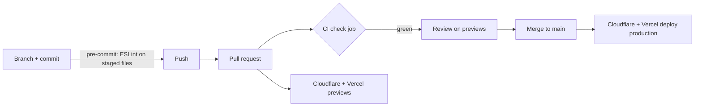
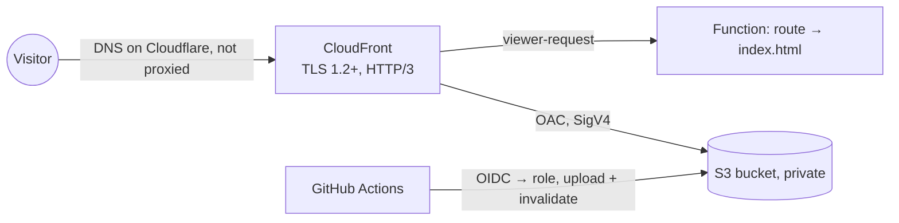

# DevOps — how this site is built, checked and shipped

This document covers everything around the code: hosting, the delivery pipeline, the quality and security gates, and the decisions behind them. It is kept in the repo so it changes with the system it describes.

- [1. Architecture](#1-architecture)
- [2. Delivery pipeline](#2-delivery-pipeline)
- [3. Quality gates](#3-quality-gates)
- [4. Security](#4-security)
- [5. Infrastructure as code](#5-infrastructure-as-code)
- [6. Performance work](#6-performance-work)
- [7. Dependencies and local tooling](#7-dependencies-and-local-tooling)
- [8. Runbooks](#8-runbooks)
- [9. Decision log](#9-decision-log)
- [10. Roadmap](#10-roadmap)

---

## 1. Architecture

A static single-page app (React 19, Vite), built once per commit and served from three places: Cloudflare Pages (production), Vercel (mirror) and AWS S3 + CloudFront (`aws.amidousoro.me`, the multi-cloud comparison).

```mermaid
flowchart LR
  dev[Developer] -->|git push / PR| gh[GitHub repo]
  gh -->|Actions| ci[CI: lint · tests · build · CSP guard · Lighthouse · size guard]
  gh -->|Git integration| cf[Cloudflare Pages]
  gh -->|Git integration| vc[Vercel]
  ci -->|green on main · OIDC| aws[S3 + CloudFront]
  dns[Cloudflare DNS<br/>amidousoro.me] --> cf
  cf --> users((Visitors))
  vc -. mirror .-> users
  aws -. aws.amidousoro.me .-> users
  build[Build step] -.->|GitHub API: public repo count| gh
```

| Piece | Role |
| --- | --- |
| **Cloudflare Pages** | Production host for `amidousoro.me` (DNS is on Cloudflare too). Builds every push; each branch gets a preview at `<branch>.portfolio-ci3.pages.dev`. Serves `index.html` for unknown paths (SPA fallback) and applies `public/_headers`. |
| **Vercel** | Mirror at `portfolio-nine-weld-45.vercel.app`, with a preview per PR. `vercel.json` adds the SPA rewrite (without it, deep links like `/projects` returned 404) and the same headers. |
| **AWS** (`infra/aws/`) | Mirror at `aws.amidousoro.me`: private S3 bucket behind CloudFront, deployed by GitHub Actions after CI passes on `main`. See [§5](#aws-mirror-s3--cloudfront). |
| **GitHub Actions** | The gate: a PR is mergeable when the `check` job is green. |
| **GitHub API** | Read at build time for the "N+ projects" tile (see [§6](#build-time-data)). |
| **Terraform** (`infra/cloudflare/`) | Declares the Cloudflare side: DNS records, the Pages project, the zone's TLS settings. State in Cloudflare R2. See [§5](#5-infrastructure-as-code). |

There is no server and no database: the attack surface is the static files and the headers that come with them.

## 2. Delivery pipeline



- Work happens on a branch; nothing is pushed straight to `main`.
- Every PR gets the CI job **and** two live previews, so a change is reviewed on a real URL before it ships.
- Merging to `main` deploys both hosts. Rolling back is a revert PR (or redeploying a previous build from the Cloudflare/Vercel dashboard for an immediate fix).

## 3. Quality gates

`.github/workflows/ci.yml` runs on every pull request and every push to `main` (Node from `.nvmrc`, npm cache, 15 min timeout, superseded runs cancelled).

| Step | Fails when | Why it exists |
| --- | --- | --- |
| `npm ci` | lockfile and `package.json` disagree | reproducible installs |
| `npm run lint` | any ESLint error | style and React-hooks rules |
| `npm run test:run` | any Vitest test fails (68 tests) | behaviour: navigation, filters, case studies, a11y roles, CSP helpers… |
| `npm run build` | type errors (`tsc -b`) or build errors | the artefact that ships |
| `node scripts/check-csp.mjs` | an inline script's hash is missing from the CSP, or Cloudflare and Vercel policies differ | see [§4](#csp-hash-guard) |
| Lighthouse CI | budgets in `lighthouserc.json` broken | performance and accessibility can't silently regress |
| size guard | a file in `dist/` is over 25 MiB | Cloudflare Pages rejects such files (a 67 MB video once broke deploys) |

### Lighthouse budgets

`lighthouserc.json` serves the production build with `vite preview` and audits `/`, `/projects` and `/about`, three runs each, judged on the median run (mobile emulation, throttled CPU and network).

| Assertion | Level | Threshold |
| --- | --- | --- |
| Performance | error | ≥ 0.90 |
| Accessibility | error | = 1.00 |
| Best practices | error | = 1.00 |
| SEO | error | = 1.00 |
| Cumulative Layout Shift | error | ≤ 0.1 |
| Largest Contentful Paint | warn | ≤ 2.5 s |

Reports are uploaded to Lighthouse's temporary public storage; the job log links each one ("Open the report at …").

Performance is set at 0.90 rather than the 0.98 measured locally because shared CI runners are noisier than a laptop; the threshold catches real regressions without flaking.

## 4. Security

### Response headers

Defined twice, identically: `public/_headers` for Cloudflare, `vercel.json` for Vercel.

| Header | Value (summary) | Protects against |
| --- | --- | --- |
| `Content-Security-Policy` | everything `'self'`, plus Umami (script from `cloud.umami.is`, beacons to `gateway.umami.is`); scripts `'self'` + Umami + one SHA-256; no `object`, no framing, `base-uri`/`form-action` locked, `upgrade-insecure-requests` | XSS and injected third-party code, clickjacking |
| `Strict-Transport-Security` | `max-age=31536000; includeSubDomains` | protocol downgrade |
| `X-Content-Type-Options` | `nosniff` | MIME sniffing |
| `Referrer-Policy` | `strict-origin-when-cross-origin` | leaking full URLs to other sites |
| `Permissions-Policy` | camera, microphone, geolocation, payment, usb off | abuse of browser features |
| `Cross-Origin-Opener-Policy` | `same-origin` | cross-window attacks |
| `Cache-Control` on `/assets/*` | `public, max-age=31536000, immutable` | (performance) hashed files never change in place |

Apart from analytics, the site makes no network requests at runtime and loads no third-party script, font or image, which is what makes a policy this strict possible. The one exception, Umami, is allowed by exact origin, not by a wildcard ([§6](#analytics)). Fonts are self-hosted for the same reason (and for speed, see [§6](#6-performance-work)).

`style-src` keeps `'unsafe-inline'`: React writes some inline `style` attributes (view-transition names, brand colours). Inline styles cannot run code, so the risk is low and documented rather than hidden.

### CSP hash guard

`index.html` contains one inline script, run before React to apply the saved theme without a flash. The CSP allows it by its SHA-256 instead of allowing all inline scripts.

The risk with a hash: edit that script and the browser blocks it in production, with no build error. `scripts/check-csp.mjs` closes the gap. After the build it:

1. hashes every executable inline script in `dist/index.html` (JSON-LD is data, not code, so it is skipped);
2. checks each hash is in the CSP from `public/_headers`;
3. checks `vercel.json` serves the exact same policy.

Its helpers (`scripts/csp.mjs`) are unit-tested in `src/__tests__/csp.test.ts`.

**How it was verified:** every page, plus the case-study dialog with its video, was loaded in Chrome behind the real headers with zero CSP violations. Counter-test: with the hash removed, Chrome blocked the script and reported the very hash the policy contains, so the check is not blind.

### Supply chain

- Dependabot keeps npm packages and GitHub Actions current ([§7](#7-dependencies-and-local-tooling)).
- `npm ci` installs exactly what `package-lock.json` pins.
- The build reads the GitHub API with the workflow's own short-lived `GITHUB_TOKEN`; no personal token is stored.

## 5. Infrastructure as code

Everything Cloudflare serves the site with is described in `infra/cloudflare/` and changed through pull requests, not by clicking in the dashboard.

| File | Manages |
| --- | --- |
| `dns.tf` | apex and `www` CNAMEs to Pages (proxied); the 5 MX records and the SPF record of the Namecheap email forwarding |
| `pages.tf` | the Pages project: GitHub source, build command, production branch, preview policy, runtime |
| `zone_settings.tf` | `always_use_https`, `min_tls_version`, `ssl`, `tls_1_3`, `automatic_https_rewrites` |
| `imports.tf` | the one-off adoption of the resources first created by hand |
| `versions.tf` | Terraform ≥ 1.10, provider `cloudflare/cloudflare ~> 5.26`, the R2 backend |

### Adopting what already existed

The DNS records, the Pages project and the settings were created in the dashboard long before Terraform. They were **imported**, not recreated: `import` blocks map each resource to its real ID, and the configuration was written (DNS, settings) or generated then cleaned up (Pages) until the plan read:

```
Plan: 14 to import, 0 to add, 0 to change, 0 to destroy.
```

Zero changes is the proof that the code describes exactly what runs. Only after that baseline do changes start, each one as its own reviewed diff.

### TLS settings: declared, not inherited

The import showed `always_use_https = off` and `min_tls_version = 1.0`, which looked like two holes. Testing the live behaviour showed they were not:

- `http://amidousoro.me` already answered `301` to HTTPS: Pages redirects on its own;
- an SSL Labs scan (2026-10-01) graded the site **A+** and found **only TLS 1.2 and 1.3**: Cloudflare no longer serves 1.0/1.1 here.

So the site was secure *by platform default*, not by its own configuration. The settings were still changed, in their own PR with a 3-change plan, so the guarantee lives in this repo instead of depending on defaults that can change:

| Setting | Before | After | Effect |
| --- | --- | --- | --- |
| `always_use_https` | off | on | the edge redirects to HTTPS itself, whatever the origin does |
| `min_tls_version` | 1.0 | 1.2 | TLS 1.0/1.1 refused by configuration (RFC 8996), not by chance |
| `ssl` | full | strict | Cloudflare now **validates** the Pages certificate on the edge-to-origin leg (the one real gain) |

Lesson kept: read the setting, then **test the behaviour** before calling it a vulnerability.

### State

The state file lives in a private R2 bucket, `portfolio-tfstate`, through Terraform's S3 backend (R2 speaks the S3 API). `use_lockfile = true` uses S3-native locking, so a local run and a CI run cannot write the state at the same time. Nothing about the state is committed: `infra/cloudflare/.gitignore` excludes it.

### Credentials, least privilege

| Credential | Scope | Where it lives |
| --- | --- | --- |
| Cloudflare API token `terraform-portfolio` | account: Cloudflare Pages edit · zone `amidousoro.me` only: Zone read, DNS edit, Zone Settings edit · expires 2027-10-01 | GitHub secret `CLOUDFLARE_API_TOKEN`; locally `~/.config/cloudflare/portfolio.env` (mode 600) |
| R2 key `terraform-state` | object read & write on the `portfolio-tfstate` bucket only | GitHub secrets `R2_ACCESS_KEY_ID`, `R2_SECRET_ACCESS_KEY`; same local file |
| Account and zone IDs | not secret | GitHub variables `CLOUDFLARE_ACCOUNT_ID`, `CLOUDFLARE_ZONE_ID`; looked up from the API locally |

The token was checked after creation: it sees one zone (`amidousoro.me`) and one Pages project, nothing else.

### Pipeline

`.github/workflows/terraform.yml` runs only when `infra/cloudflare/` (or the workflow) changes:

- **pull request**: `fmt -check`, `init`, `validate`, `plan`; the plan is posted as a PR comment (updated in place on each push);
- **merge to `main`**: the same plan, then `apply`;
- **manual run** (`workflow_dispatch`): plan only. A non-empty plan means someone changed something in the dashboard: that's drift, to fold back into the code or undo.

Runs are serialised and never cancelled, so an apply can't be cut off halfway.

### Working locally

```sh
cd infra/cloudflare
./tf.sh init     # once: configures the R2 backend
./tf.sh plan     # what would change
```

`tf.sh` loads the token and the R2 key from `~/.config/cloudflare/portfolio.env`, looks up the account and zone IDs, and maps the R2 key to the `AWS_*` variables for that process only, so it never collides with real AWS credentials. Apply from CI, not from a laptop: the PR is the review.

### AWS mirror: S3 + CloudFront

The same build also runs on AWS, at `aws.amidousoro.me`, to compare two ways of serving a static site with numbers rather than opinions. It lives in its own stack, `infra/aws/`, with its own state.



| File | Manages |
| --- | --- |
| `s3.tf` | the private site bucket: public access blocked, ACLs off, encrypted; its policy lets only this distribution read it and refuses plain HTTP |
| `cloudfront.tf` | the distribution (every edge location, HTTP/2 and 3, IPv6, TLS 1.2 minimum), the Origin Access Control, the SPA routing function (`spa-router.js`) |
| `headers.tf` | the response headers policy, **read from `public/_headers`** |
| `dns.tf` | the ACM certificate (us-east-1, as CloudFront requires) and its validation record, the `aws` CNAME on Cloudflare |
| `github_oidc.tf` | GitHub's OIDC provider and the deploy role |
| `budget.tf` | the 1 USD monthly budget, created by hand first and imported |

**Choices worth explaining:**

- **DNS stays on Cloudflare.** The stack drives two providers: AWS for the site, Cloudflare for its two records. A Route53 zone would cost 0.50 USD a month for nothing. The `aws` record is *DNS only*: proxied, visitors would hit Cloudflare first and the comparison would measure Cloudflare twice.
- **One source for the security headers.** `headers.tf` parses the `/*` block of `public/_headers` and maps each header to CloudFront (CSP, HSTS, nosniff and Referrer-Policy have dedicated fields, the rest go as custom headers). Change `_headers` and the next plan shows the CloudFront update: the three hosts can't drift.
- **Private bucket, no website endpoint.** CloudFront signs its requests with OAC; S3 serves nothing directly (a direct request gets 403). CloudFront may also list the bucket, so a missing file is a 404, not a misleading 403.
- **SPA routing at the edge.** A path with no file extension (`/projects`, `/about`, an unknown route) is rewritten to `/index.html` by a CloudFront Function; React renders the page or its 404. Files pass through untouched. Same behaviour as the Pages fallback.
- **Caching set at upload.** Hashed `/assets/*` go up with `max-age=31536000, immutable`, everything else with `max-age=0, must-revalidate`; the AWS managed `CachingOptimized` policy honours both and compresses (brotli, gzip). Each deploy invalidates `/*`.

**Deploy without stored keys.** `.github/workflows/deploy-aws.yml` runs when CI finishes green on `main` (or by hand). The job asks GitHub for an OIDC token and trades it for a one-hour session of `portfolio-github-deploy`. That role trusts only tokens whose subject is `repo:AmidNova/portfolio:environment:aws`, and the GitHub environment `aws` accepts only `main`; its permissions are `s3:ListBucket`, `PutObject`, `DeleteObject` on the site bucket and `CreateInvalidation` on this distribution. The job builds, uploads assets before `index.html` (a new page never points at missing files), deletes stale files last, waits for the invalidation, then smoke-tests `/`, `/projects`, `/about` and the CSP header.

**State and bootstrap.** The state is in `portfolio-tfstate-<account-id>`, an S3 bucket created once by `bootstrap.sh` (Terraform can't create the bucket its own state lives in): private, versioned (a corrupted state can be rolled back), encrypted, S3-native locking.

**Access.** Humans sign in through IAM Identity Center (permission set `AdministratorAccess`, MFA); the root user has MFA and is kept for billing. Locally, `tf.sh` uses the SSO profile `portfolio`, so no long-lived AWS key exists on the laptop either.

**Verified after the first apply** (2026-10-02): every header identical to Cloudflare; `/projects`, `/about`, unknown routes 200; a missing file 404; `/assets` served `immutable` and compressed; `http://` → 301 to HTTPS; TLS 1.1 refused, 1.2 accepted; the bucket refuses direct requests. A re-plan reads *No changes*.

**First apply was local, by necessity.** CI had no way into AWS yet: this stack creates the very role CI would use. From here, changes go through PRs; a Terraform pipeline for this stack (plan on PR with a read-only role) is the next step.

```sh
cd infra/aws
AWS_PROFILE=portfolio ./bootstrap.sh   # once: the state bucket
./tf.sh init                           # once: backend
./tf.sh plan
```

## 6. Performance work

Measured with Lighthouse, mobile profile, 2026-10-01.

| Change | Effect |
| --- | --- |
| Self-hosted Geist (`@fontsource-variable`) instead of Google Fonts | removed ~770 ms of render-blocking CSS |
| Images resized to their displayed size (photos ≤ 1200 px, logos ≤ 240 px, badge quantised) | ≈ 1.4 MB less; profile photo 709 → 266 KB |
| Demo video re-encoded | 67.7 MB → 9.4 MB, loaded with `preload="metadata"` |
| Preload of the latin Geist file | CLS on `/projects` 0.15 → **0** (the late font swap shifted the grid; found by Lighthouse CI) |
| **Result** | Home: performance 90 → **98**, LCP 3.1 s → **2.2 s**; `/projects` 99 |

### Analytics

Visits are counted with **Umami Cloud**: no cookies and no personal data, so no consent banner is needed.

- The script is loaded `async`, not `defer`: deferred scripts run in document order, so a slow response from `cloud.umami.is` would hold back the app's own module. With `async` it runs whenever it arrives and never delays the page.
- `data-domains="amidousoro.me"`: PR previews, the Vercel mirror and `localhost` load the script but send nothing, so the stats only count production.
- It hooks `history.pushState`, so each SPA route (`/projects`, `/about`) is counted without code in the app.
- Verified in Chrome behind the real CSP: the script loads, `gateway.umami.is` is reachable, and a control request to another origin is still blocked.

### Build-time data

The "N+ projects" tile shows the number of public GitHub repositories. `vite.config.ts` fetches it from the GitHub API during `vite build` only (never in dev or tests), with a 5 s timeout. If the call fails (offline, rate limit), the site falls back to the last known count instead of failing the build or showing 0 (`src/lib/repoCount.ts`, unit-tested).

## 7. Dependencies and local tooling

- **Dependabot** (`.github/dependabot.yml`), every Monday:
  - npm: minor and patch updates grouped in one PR; majors one by one, since they deserve a real look;
  - GitHub Actions: one grouped PR.
  Each Dependabot PR runs the full CI, Lighthouse included, so an update that breaks the build or slows the site is caught before merge.
- **Pre-commit hook** (husky + lint-staged): ESLint with `--max-warnings=0` on the staged `.ts`, `.tsx` and `.js` files only, so commits stay fast. Installed by `npm install` (`prepare` script). Outside a git checkout (the Cloudflare and Vercel builders) `husky` exits cleanly.

## 8. Runbooks

### The theme script in `index.html` changed

CI fails with `inline script hash 'sha256-…' is missing from the CSP`.

1. Copy the hash from the error.
2. Replace the old `'sha256-…'` in **both** `public/_headers` and `vercel.json`.
3. Re-run CI. `node scripts/check-csp.mjs` after `npm run build` checks it locally.

### Adding a third-party script (for example analytics)

The CSP blocks every outside origin by default.

1. Add the origin to `script-src` (and `connect-src` if it sends data) in both header files. Real example, Umami: `https://cloud.umami.is` in `script-src` (the script), `https://gateway.umami.is` in `connect-src` (where it sends page views). Read the vendor's script to find both, as was done here.
2. Load the page in a browser and check the console for CSP violations.
3. Watch the Lighthouse result on the PR: a third-party script costs performance.

### Lighthouse CI fails

1. Open the report linked in the job log for the failing URL.
2. Real regression (heavier image, layout shift, missing label): fix it in the PR.
3. Runner noise (performance just under 0.90 with no related change): re-run the job once. If it fails again, treat it as real.

### Changing DNS, Pages or a zone setting

1. Edit the `.tf` file on a branch, run `./tf.sh plan` locally if you like.
2. Open a PR: the Terraform workflow comments the plan. Check it changes only what you meant (a `destroy` on an MX record means email stops).
3. Merge: CI applies it.

Never change these in the dashboard: the next plan would show the drift and the next apply would revert it.

### Rotating the Cloudflare token or the R2 key (before 2027-10-01)

1. Create the new token/key with the same scopes (see the credentials table in [§5](#credentials-least-privilege)).
2. `gh secret set CLOUDFLARE_API_TOKEN` (or the R2 pair), and update `~/.config/cloudflare/portfolio.env`.
3. Run the Terraform workflow manually: a clean plan proves the new credentials work.
4. Revoke the old token/key in the dashboard.

### The AWS mirror serves an old version

1. Check the last *Deploy to AWS* run: it only starts after CI passes on `main`.
2. Re-run it by hand (*Run workflow*): it rebuilds, uploads and invalidates the cache.
3. `curl -sI https://aws.amidousoro.me/ | grep -i x-cache` shows whether CloudFront served from cache.

### A deploy broke production

1. Fastest: in the Cloudflare Pages dashboard, roll back to the previous deployment (same in Vercel).
2. Then revert the offending PR on GitHub so `main` matches what is served.

### Checking the security headers

```sh
curl -sI https://amidousoro.me/ | grep -iE 'content-security|strict-transport|x-content|referrer|permissions|cross-origin'
```

For a graded report, run https://securityheaders.com/?q=amidousoro.me in a browser.

## 9. Decision log

| Decision | Why | Trade-off accepted |
| --- | --- | --- |
| Two hosts (Cloudflare + Vercel) | free tiers, previews on both, a working fallback if one has an incident | headers and rewrites must be kept identical; the CSP guard checks it |
| CSP with a script **hash**, not a nonce | static hosting has no per-request server to mint nonces | the hash must follow the script; automated by the guard |
| `'unsafe-inline'` kept for styles only | React inline style attributes; styles cannot execute code | slightly weaker style policy, documented |
| Umami Cloud for analytics | cookieless (no consent banner), small script (~5 KB), SPA routes tracked out of the box, works on both hosts | one third-party origin in the CSP; the data lives at Umami |
| Self-hosted fonts | no third-party origin in the CSP, no render-blocking request | fonts ship in the bundle (~50 KB for the latin files) |
| Lighthouse performance at 0.90, LCP as a warning | CI runners are noisier than local runs; `/about` LCP (~3 s) is client-side render time, inherent to an SPA | small regressions under the threshold can pass; the reports still show them |
| No Docker image | the site is static files on an edge platform; a container would be ceremony, not value | — |
| Import the existing Cloudflare setup instead of recreating it | recreating DNS records means downtime and lost email; import keeps everything live | the code first mirrors the dashboard as it was, flaws included; fixes follow as separate diffs |
| Terraform state in R2 | stays inside Cloudflare, S3-compatible, native locking, free at this size | one more credential (the R2 key) to keep and rotate |
| Apply on merge, no manual approval step | the PR review of the posted plan is the approval; a single maintainer | a merged mistake is applied straight away; mitigated by small, separate diffs |
| AWS mirror on S3 + CloudFront, DNS kept on Cloudflare | a real multi-cloud comparison on the same build; no Route53 zone to pay for | two providers in one stack; the Cloudflare token must reach that zone |
| Security headers on AWS parsed from `public/_headers` | one source of truth across three hosts | a format change in `_headers` must keep the parser working (the plan fails loudly if not) |
| OIDC role bound to a GitHub environment limited to `main` | no AWS key in GitHub; a branch or a fork can't deploy | the environment's branch rule is part of the security model and lives in GitHub settings, not in code |
| Repo count at build time, with a fallback | the tile stays true without a manual edit | a build without network shows the last known count |

## 10. Roadmap

- [x] **Level 1, CI/CD foundations** — CI, Lighthouse budgets, security headers with a guard, Dependabot, pre-commit hooks.
- [x] **Level 2, infrastructure as code** — Terraform for Cloudflare (DNS, Pages project, TLS settings), imported with zero changes; state in R2 with locking; plan on PRs, apply on merge. See [§5](#5-infrastructure-as-code).
- [x] **Level 2b, TLS settings declared, not inherited** — `always_use_https` on, minimum TLS 1.2, SSL mode Full (strict). See [§5](#tls-settings-declared-not-inherited).
- [x] **Level 3, AWS in parallel** — the same build on S3 + CloudFront at `aws.amidousoro.me`, in Terraform, deployed from GitHub Actions with OIDC (no stored AWS keys). See [§5](#aws-mirror-s3--cloudfront).
- [ ] **Level 3b** — Terraform pipeline for `infra/aws` (plan on PR, apply on merge, OIDC roles), then a written Cloudflare vs AWS comparison (cost, latency, operations) from real measurements.
- [x] **Analytics** — Umami Cloud, cookieless, production only.
- [ ] **Later** — pre-rendering to fix the `/about` LCP; uptime monitoring.
